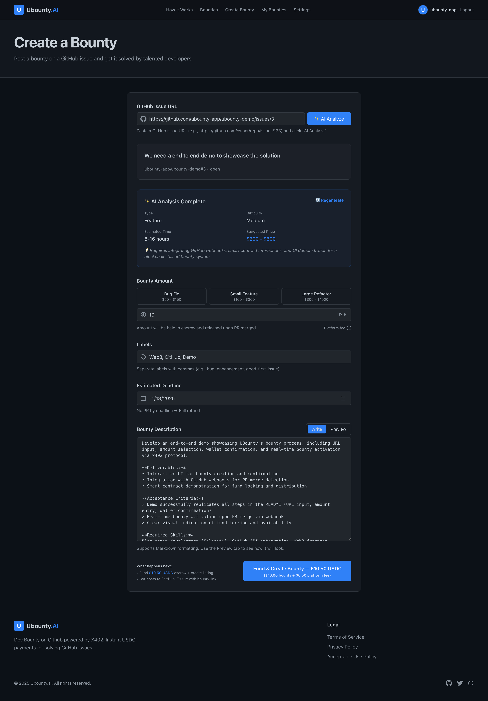
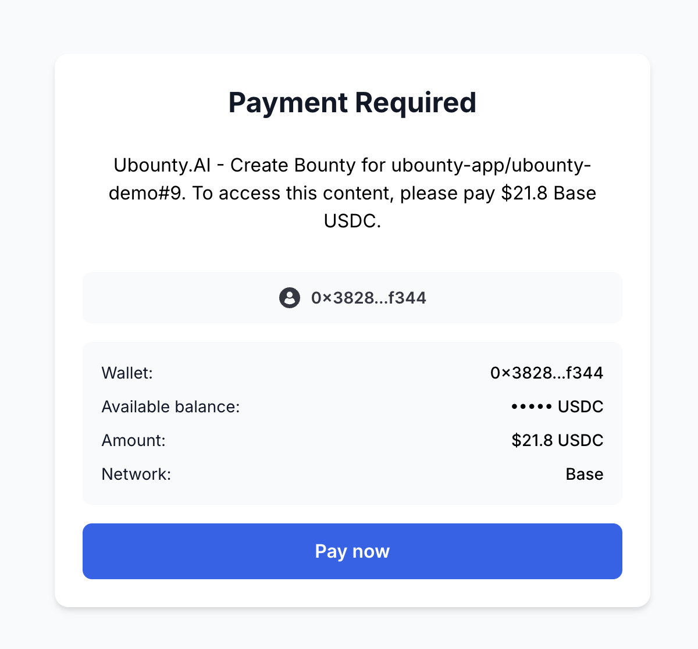

# UBounty.ai - End-to-End Demo

> **Create & fund a GitHub bounty in 15 seconds** — no account, no KYC, no friction.

---

## What is UBounty?

**UBounty.ai** is an automated cryptocurrency bounty platform for GitHub issues. Fund any public GitHub issue and pay developers instantly when they solve it.

**Key Features:**
- ⚡ **15-second bounty creation** with AI-powered analysis
- 🔗 **Works with ANY public GitHub repo** (no permission needed)
- 💰 **Instant USDC payments** on Base blockchain via x402 protocol
- 🤖 **Automatic settlement** when PRs are merged
- 🔒 **Trustless escrow** - funds locked in smart contracts
- 💵 **5% platform fee** - transparent pricing

---

## Quick Demo: Create a Bounty in 15 Seconds

### Step 1: Enter Issue Details & AI Analysis (7s)



1. **Login with GitHub** → Click "Create Bounty"
2. **Paste GitHub issue URL**: `https://github.com/ubounty-app/ubounty-demo/issues/3`
3. **Click "AI Analyze"** → Claude AI suggests pricing, difficulty, and requirements
4. **Set amount**: $10.00 USDC (+ $0.50 fee = $10.50 total)
5. **Add labels & deadline** (optional)
6. **Click "Fund & Create Bounty"**

**AI Analysis provides:**
- Type: Feature / Bug Fix / Enhancement
- Difficulty: Easy / Medium / Hard
- Estimated time: 8-16 hours
- Suggested price range: $200-$600
- Detailed requirements breakdown

---

### Step 2: Pay with x402 Protocol (8s)



1. **x402 payment modal opens** showing:
   - Your wallet: `0x3828...f344`
   - Amount: `$10.5 USDC`
   - Network: `Base`
2. **Click "Pay now"**
3. **Approve in your wallet** (MetaMask/Coinbase Wallet/Rainbow)
4. **Funds locked on-chain** in 3-5 seconds

✅ **Bounty is now live!** UBounty automatically:
- Verifies transaction on Base blockchain
- Posts bounty comment on GitHub issue ([see example](https://github.com/ubounty-app/ubounty-demo/issues/3))
- Lists bounty on [ubounty.ai/bounties](https://ubounty.ai/bounties)

**Real example:** [Transaction on BaseScan](https://basescan.org/tx/0x9d992a57654d54c644fc5ae99959b4436e5373cfcb197255f465c1ba84837550)

---

## How Developers Claim Bounties

### 1. Discover Bounty
- Browse [ubounty.ai/bounties](https://ubounty.ai/bounties)
- See UBounty bot comment on GitHub issues
- Filter by price, difficulty, or tech stack

### 2. Submit Solution
```bash
# Fork repo and create PR
git checkout -b fix-issue-3
# ... make changes ...
git commit -m "Fix issue"
git push
```

**Important:** Include `Fixes #3` in PR description to link to bounty!

### 3. Get Paid
1. **Maintainer merges your PR** → Bounty creator gets notified
2. **Creator approves payment** (up to 7 days)
3. **Connect wallet** at [ubounty.ai/settings](https://ubounty.ai/settings)
4. **Receive USDC instantly** (3-5 seconds)

**Protection:** If creator doesn't decide within 7 days, payment auto-splits equally among all merged PRs.

---

## Payment Scenarios

**Single Developer:**
- Your PR merged → You get 100%

**Multiple Developers:**
- Creator allocates % to each contributor
- Example: Alice 70% ($70), Bob 30% ($30)

**Auto-Split (if creator doesn't decide):**
- After 7 days, funds split equally among all merged PRs
- Your protection against negligent creators

---

## Technical Details

| Component | Technology |
|-----------|-----------|
| **Blockchain** | Base (Ethereum L2) |
| **Currency** | USDC stablecoin |
| **Protocol** | x402 (instant payments) |
| **Settlement** | 3-5 seconds |
| **Platform Fee** | 5% (paid by creator) |
| **Gas Fees** | Free (sponsored by platform) |
| **Min Bounty** | $10 USDC |

**Architecture:**
```
User Wallet → x402 Protocol → Base Blockchain Escrow
                                      ↓
                           (Locked until approved)
                                      ↓
                    Creator Approves → Developer Wallet (3-5s)
```

---

## FAQ

**Q: Do I need to own the repo to create a bounty?**
No! Create bounties on ANY public GitHub issue.

**Q: Can multiple developers earn from one bounty?**
Yes! Creator can split payment among multiple contributors.

**Q: What if creator never approves payment?**
Auto-split after 7 days protects developers.

**Q: Are payments reversible?**
No. Cryptocurrency payments are final and on-chain.

**Q: What wallets are supported?**
Any wallet with Base network: MetaMask, Coinbase Wallet, Rainbow, WalletConnect.

**Q: Do developers pay fees?**
No! Developers receive 100% of allocated amount. Gas fees paid by platform.

---

## Get Started

**For Creators:** [ubounty.ai/create](https://ubounty.ai/create)
**For Developers:** [ubounty.ai/bounties](https://ubounty.ai/bounties)
**View Example:** [Issue #3 with live bounty](https://github.com/ubounty-app/ubounty-demo/issues/3)

---

## Resources

- **Website:** [ubounty.ai](https://ubounty.ai)
- **Full Docs:** [ProductFeatures](https://github.com/ubounty-app/ProductFeatures)
- **BaseScan:** [basescan.org](https://basescan.org)
- **Support:** support@ubounty.ai

---

*Powered by x402 protocol | Built on Base | Instant USDC payments* ⚡

[](https://opensource.org/licenses/MIT)
